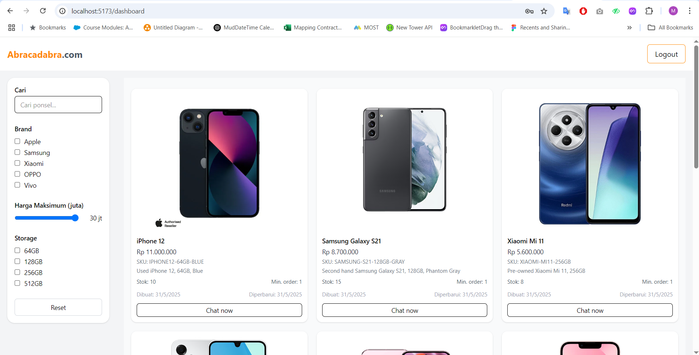

## 📱 Fullstack Web App with Turborepo

This project follows a **scalable architecture**, integrates a **fully type-safe API layer**, and is **production-ready** for deployment.

---

## 🚀 Tech Stack

### 🖥️ Frontend
- **Vite + React + Zustand** — Modern SPA with file-based routing using React Router v7.
- **Tailwind CSS** — Utility-first CSS framework for rapid UI development.
- **Zod** — Schema validation with full TypeScript support.

### ⚙️ Backend
- **Bun** — Ultra-fast JavaScript runtime and package manager.
- **Hono** — Lightweight web framework for building fast APIs.
- **tRPC** — End-to-end type-safe API routes.
- **Prisma** — Type-safe and auto-generated ORM.
- **PostgreSQL** — Relational database used in production setups.
- **Hono Auth** — Simple and extensible authentication system.

### 🧰 Tooling
- **Turborepo** — High-performance monorepo build system.
- **Docker + Docker Compose** — For containerized local development (PostgreSQL setup).
- **TypeScript** — Type safety across the full stack.

---

### 🧪 Demo

```bash
 https://akp-store-frontend-production.up.railway.app/

```


---

### 📁 Monorepo Structure
```bash

apps/
  ├── web/       # React frontend (Vite + Zustand + Tailwind)
  └── api/       # Hono + tRPC backend with Clean Architecture

packages/
  └── db/        # Shared Prisma setup, database models, DTOs, etc.
```
---

### 🧪 Development

```bash
## Setup

# Clone the repository
git clone https://github.com/partaMrt/AKP-Test.git
cd AKP-Store

# Install dependencies
bun install

# Start PostgreSQL with Docker
docker-compose up -d

# Apply Prisma generate , migrations & seed
bunx prisma generate --schema=packages/db/prisma/schema.prisma
bunx prisma migrate deploy --schema=packages/db/prisma/schema.prisma
bun run packages/db/prisma/seed.ts

# Start dev servers
bun run dev  # or: turbo run dev --parallel

```
---

### 👨‍💻 Author

Built by Me
